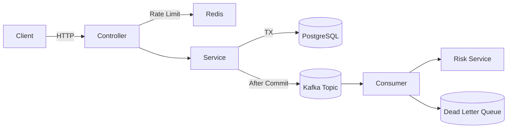

# architecture.md

## High-Level Architecture

Yes, **diagrams are strongly recommended**. They make your design instantly understandable to interviewers. Text explains *why*, diagrams explain *how fast*.

Below is a complete architecture document with **Mermaid diagrams** that render directly on GitHub.

---

## System Overview

### Design Principles

* Database is the **single source of truth**
* Idempotency and optimistic locking protect money safety
* Side effects are isolated behind Kafka
* External systems are treated as unreliable
* Failures are contained and observable

---

## Components

### API Layer

* Accepts client requests
* Applies Redis-based rate limiting
* No business logic

### Service Layer

* Owns transactions and idempotency
* Publishes events after DB commit

### Database (PostgreSQL)

* Stores transaction state
* Enforces idempotency via unique constraints

### Kafka

* Handles asynchronous side effects
* Ensures at-least-once delivery
* DLQ for poison messages

### Redis

* Rate limiting only
* Never used for money state

### Risk Service

* Advisory only
* Called asynchronously
* Integrated with timeout + fallback

---

