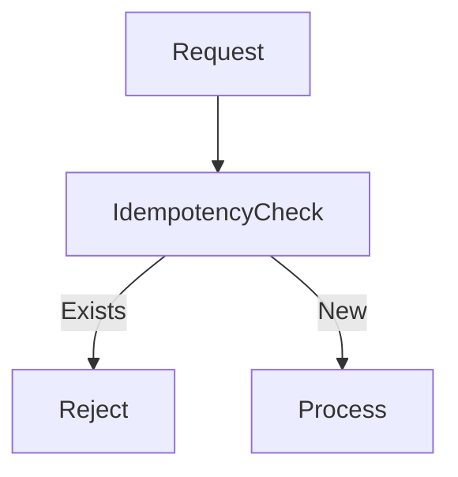
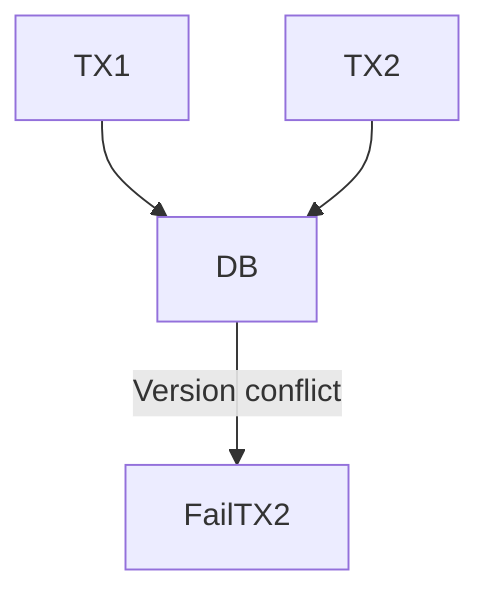
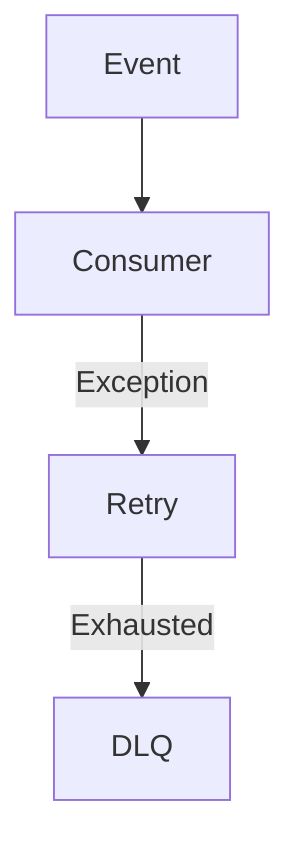
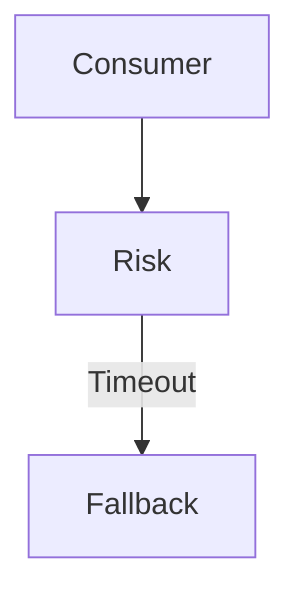

# failure-scenarios.md

## Duplicate Request

* Duplicate idempotency key
* Deterministic rejection
* No double charge

---

## Concurrent Update

* Optimistic locking detects conflict
* One succeeds, one fails cleanly

---

## Kafka Consumer Failure

* No message loss
* DLQ preserves failed events

---

## Risk Service Timeout

* Core transaction unaffected
* Safe default applied

---
