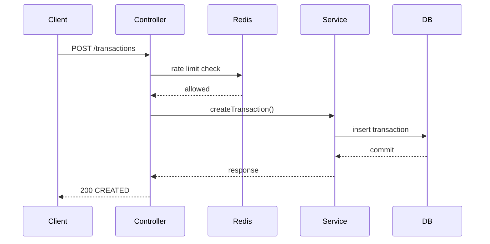
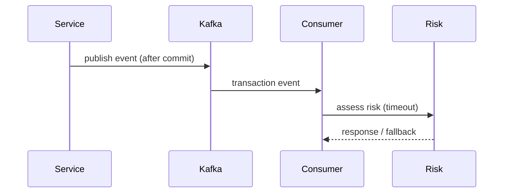

# request-flow.md

## Synchronous Request Flow

```mermaid
sequenceDiagram
    participant Client
    participant Controller
    participant Redis
    participant Service
    participant DB

    Client->>Controller: POST /transactions
    Controller->>Redis: rate limit check
    Redis-->>Controller: allowed
    Controller->>Service: createTransaction()
    Service->>DB: insert transaction
    DB-->>Service: commit
    Service-->>Controller: response
    Controller-->>Client: 200 CREATED
```

## Asynchronous Flow

```mermaid
sequenceDiagram
    participant Service
    participant Kafka
    participant Consumer
    participant Risk

    Service->>Kafka: publish event (after commit)
    Kafka->>Consumer: transaction event
    Consumer->>Risk: assess risk (timeout)
    Risk-->>Consumer: response / fallback
```

---
