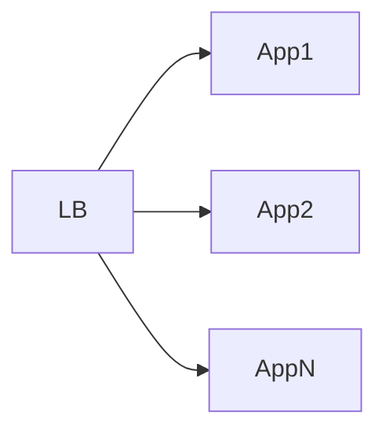
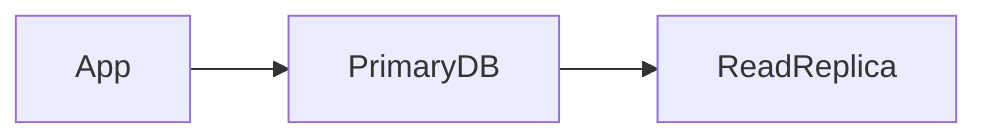
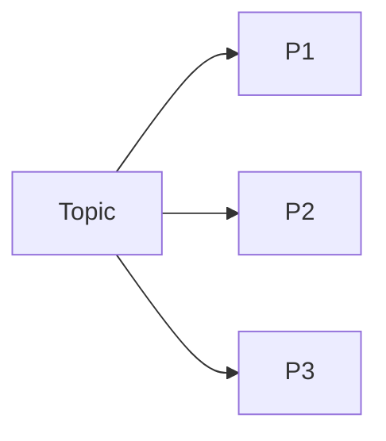

# scaling-strategy.md

## Stateless Scaling

* Horizontal scaling
* No session state

---

## Database Scaling

* Writes to primary
* Reads scale independently

---

## Kafka Scaling

* Partitions increase throughput
* Consumers scale horizontally

---