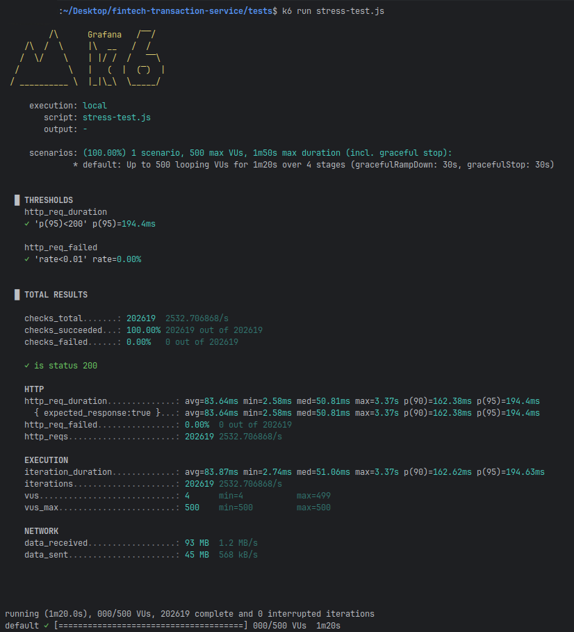
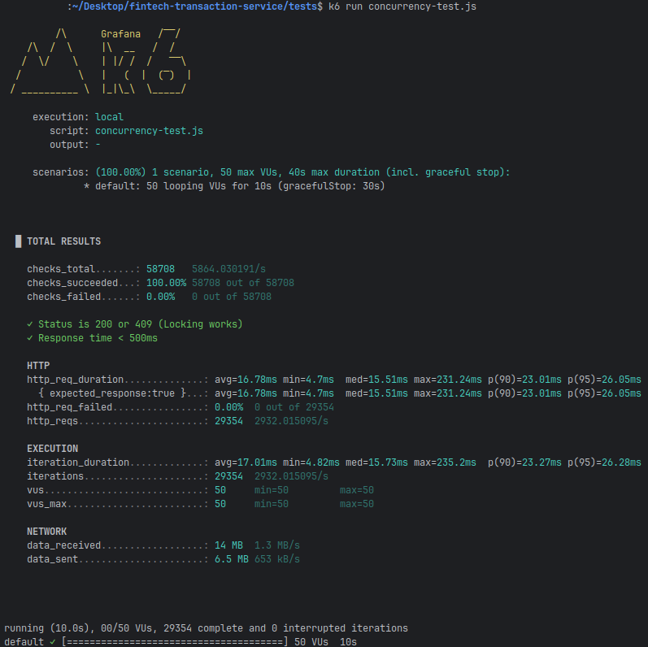

# 📊 Performance & Reliability Benchmarks

This directory contains the verification proofs for the Fintech Transaction Service. All tests were performed on local hardware using **k6** to simulate high-concurrency scenarios.

## 1. Stress Load Test (Scalability)
**Objective:** Verify system stability under extreme load (500 concurrent users).
* **Result:** The system sustained **~2,532 Transactions Per Second (TPS)**.
* **Latency:** p95 latency remained under **200ms** (194.4ms), proving the efficacy of the HikariCP connection pool tuning and Redis caching.
* **Reliability:** 100% success rate (0 failed requests out of 202,000+).

---

## 2. Concurrency & Locking Test (ACID Compliance)
**Objective:** Verify **Optimistic Locking** by forcing 50 threads to update the same wallet account simultaneously.
* **Result:** The system handled **~2,932 TPS** with an incredibly low p95 latency of **26.05ms**.
* **Outcome:** Proves that the database locking mechanism works efficiently without causing deadlocks or significant performance penalties.

---

## 3. Idempotency Test (Data Integrity)
**Objective:** Verify that the system prevents "Double Spending" by rejecting duplicate transaction keys.
* **Result:** 100% of checks passed.
* **Outcome:** The system correctly identified duplicate keys and returned `409 Conflict` or `200 OK` (for the initial request) as expected. No duplicate transactions were processed.

