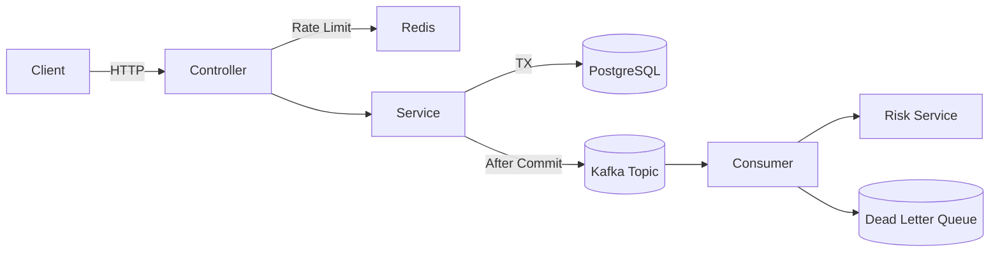
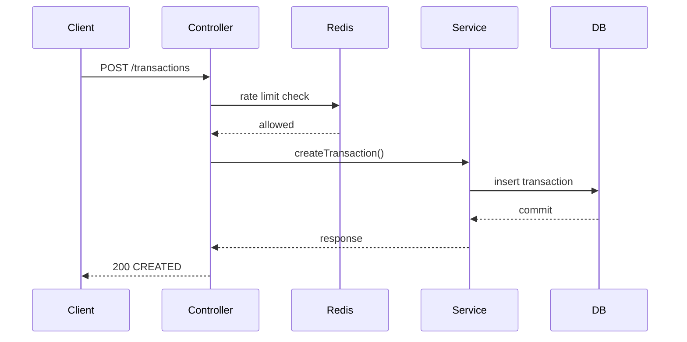
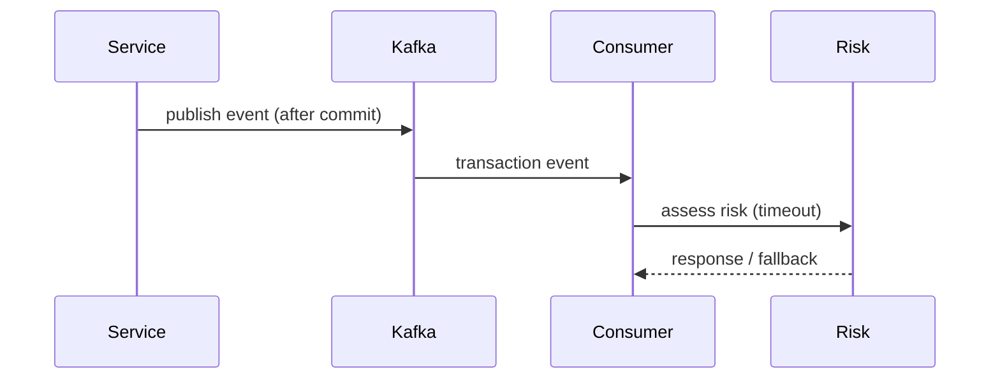
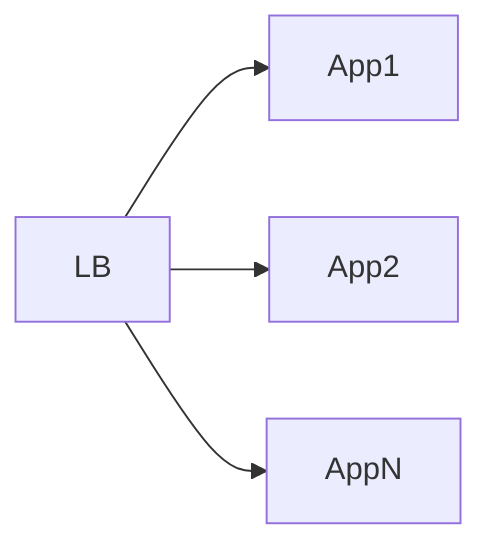
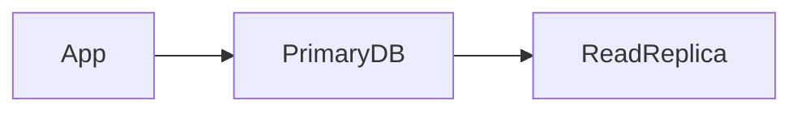
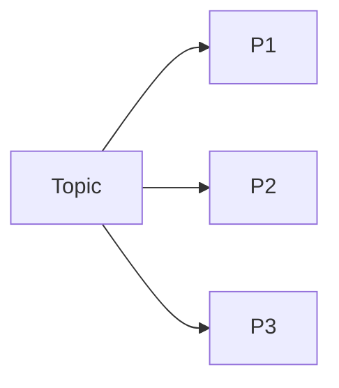

# system-design.md

## System Design Overview

This document provides a complete system design view of the Fintech Transaction Service. It focuses on **correctness, failure handling, scalability, and cost-aware tradeoffs**, without relying on cloud-vendor specifics.

The goal is to demonstrate how the system behaves under real-world constraints.

---

## High-Level Architecture Diagram

---

## Request Flow

### Synchronous Transaction Flow

### Asynchronous Side-Effect Flow

---

## Failure Scenarios (Failure Table)

| Scenario               | Detection Point         | System Behavior  | Outcome                     |
| ---------------------- | ----------------------- | ---------------- | --------------------------- |
| Duplicate request      | Idempotency key check   | Reject request   | No double charge            |
| Concurrent update      | Optimistic lock failure | Return conflict  | Deterministic failure       |
| DB transaction failure | Commit phase            | Rollback         | No partial state            |
| Kafka consumer crash   | Consumer runtime        | Retry → DLQ      | No message loss             |
| Risk service timeout   | HTTP client             | Fallback applied | Core flow unaffected        |
| Redis unavailable      | Rate limit check        | Fail fast        | Transaction logic preserved |

---

## Concurrency Handling

### Strategy

* Idempotency keys prevent duplicate processing
* Optimistic locking (`@Version`) prevents lost updates
* No pessimistic locking or long-held DB locks

### Rationale

* Optimistic locking scales better under contention
* Conflicts are explicit and observable
* Avoids deadlocks and lock amplification

---

## Scaling Strategy

### Application Layer

* Stateless services
* Horizontal scaling via additional instances
* No session affinity required

### Database Layer

* Writes handled by primary
* Read replicas scale read-heavy workloads
* Indexes on idempotency keys

### Messaging Layer

* Kafka partitions scale consumer throughput
* Consumers scale independently

---

## Cost Constraints (Local-First Design)

### Design Decisions

* No dependency on cloud-managed services
* Entire stack runs locally via Docker
* Environment-variable-based configuration

### Tradeoffs

* Lower infrastructure cost
* Slightly lower peak throughput than managed cloud services
* Greater control over behavior and debugging

### Interview Framing

> The system is designed to be cloud-agnostic. Deployment targets can be swapped without changing core logic, which avoids vendor lock-in and uncontrolled cost growth.

---

## Summary

This system demonstrates a production-grade fintech backend designed with real-world constraints in mind. It prioritizes correctness, failure isolation, and explainability over cloud branding. The architecture is scalable, resilient, cost-aware, and suitable for backend and system design interviews.
